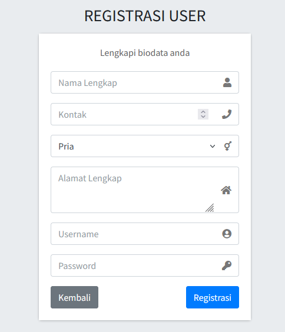
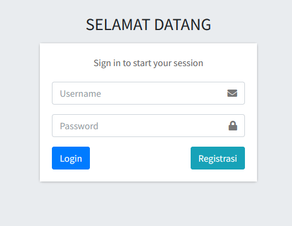
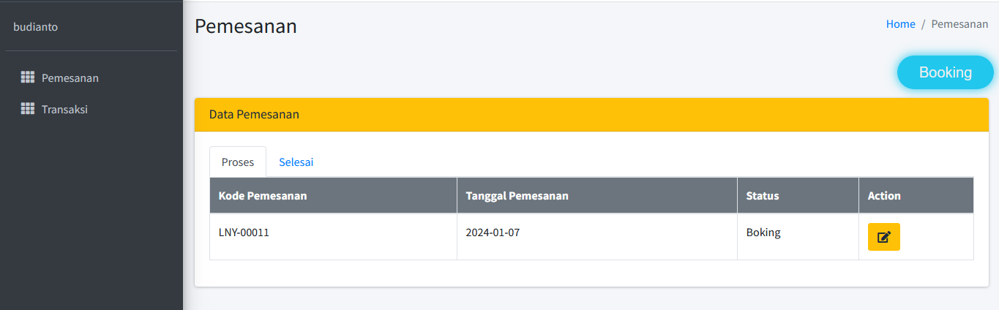
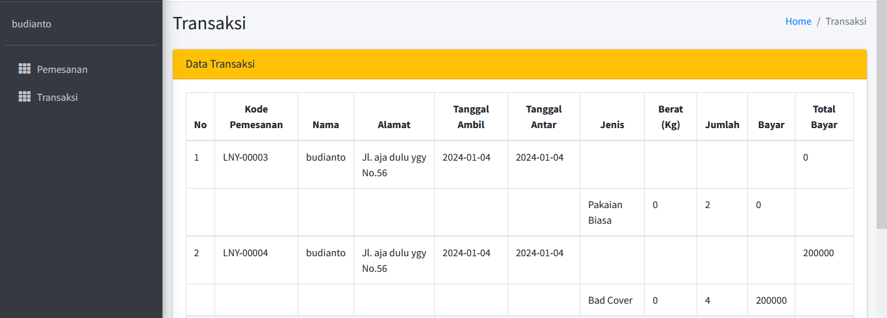

# app-laundry
Program Laundry berbasis website dibuat untuk memenuhi tugas mata kuliah rekayasa perangkat lunak. 

```
Nama   : Mohammad Hapiyansyah
NIM    : 312210243
Kelas  : TI.22.A2
```

# PELANGGAN
## 1. Melakukan registrasi dan login 





## 2. Melakukan pemesanan (booking)



## 3. Melihat data transaksi



## 4. Keluar


# ADMIN
## 1. Menginput data pelanggan

!

## 2. Mengelola jenis laundry

!

## 3. Mengelola pesanan pelanggan

!

## 4. Mengelola Transaksi

!

## 5. Mengelola laporan transaksi

!
